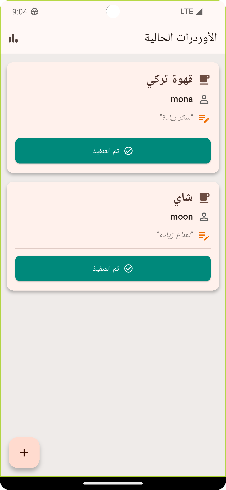
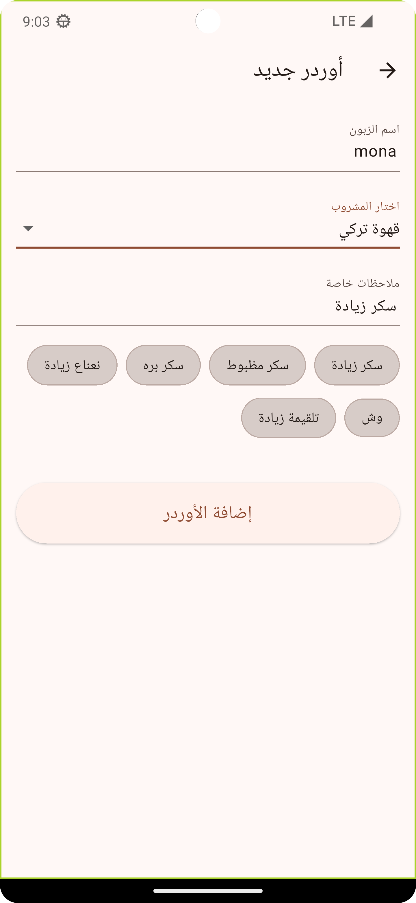

# ☕ AhwaGo - Smart Ahwa Manager

A Flutter application for a smart coffee shop manager, designed to streamline order management and sales reporting. This project was built with a strong focus on applying SOLID principles, OOP concepts, and a Clean Architecture.

---

## 📸 Screenshots

| Pending Orders Dashboard | Add New Order Screen | Daily Report Screen |
|:------------------------:|:--------------------:|:-------------------:|
|  |  |  |

---

## ✨ Features

* **Order Management:** Quickly add new orders with the customer's name and drink type.
* **Special Instructions:** Add custom notes to any order (e.g., "extra sugar").
* **Live Dashboard:** View a real-time list of all pending orders.
* **Order Completion:** Mark orders as "completed" with a single tap to clear them from the active dashboard.
* **Smart Daily Reports:** Generate end-of-day reports that include:
    * Total daily revenue.
    * Total number of completed orders.
    * A list of the top-selling drinks.
* **Full RTL Support:** The user interface is fully optimized for Arabic (Right-to-Left).

---

## 🏛️ Architectural Design & Principles

The application is built upon a clean, decoupled architecture that strictly adheres to **SOLID principles** and core **Object-Oriented Programming (OOP)** concepts, ensuring the system is maintainable, scalable, and robust. This design directly reflects the ideas of **modularity** and **abstraction** discussed in *The Object-Oriented Thought Process*.

**Core OOP concepts** are evident throughout the architecture. **Encapsulation** is a cornerstone of the design, demonstrated in the `OrderService`, where the `_orders` list is kept private. All interactions with this critical state must go through public methods like `addOrder()` and `completeOrder()`, protecting data integrity. **Inheritance** is utilized in the model layer, where the `DailySalesReport` class extends the base `Report` class to add specific properties while reusing common ones. The system also handles all drinks polymorphically through a generic `Drink` type, simplifying the logic within the services.

This architecture rigorously implements all five **SOLID principles**:
* **Single Responsibility Principle (SRP):** The logic is highly modular. The `OrderService` is solely responsible for managing the state of orders, while the `ReportGenerator` is only responsible for creating sales reports. The `AhwaCubit` acts as a mediator, and UI widgets are only responsible for presentation.
* **Open/Closed Principle (OCP):** The services (`OrderService`, `ReportGenerator`) are closed for modification. They operate on the `Drink` abstraction, meaning that if the menu data changes (e.g., adding a new type of drink in the UI), the core logic of these services does not need to be altered.
* **Liskov Substitution Principle (LSP):** This principle is upheld by the design. For example, an instance of `DailySalesReport` could be used anywhere a base `Report` object is expected without altering the program's correctness.
* **Interface Segregation Principle (ISP):** This is achieved by defining focused contracts for our services: `IOrderService` and `IReportGenerator`. Components like the `AhwaCubit` depend on these small, specific interfaces rather than a large, monolithic class.
* **Dependency Inversion Principle (DIP):** High-level modules like `AhwaCubit` depend on **abstractions** (`IOrderService`, `IReportGenerator`), not on concrete implementations. This is achieved via **Dependency Injection** in `main.dart`, where the concrete services are "injected" into the `AhwaCubit`, making the system flexible and easy to test.

---

## 🛠️ Tech Stack

* **Language:** Dart
* **Framework:** Flutter
* **State Management:** `flutter_bloc` / `Cubit`
* **Architecture:** Clean Architecture, Dependency Injection
* **Core Philosophy:** SOLID & OOP
* **Formatting:** `intl` package for date and currency localization.

---

## 🚀 How to Run

1.  Clone this repository:
    ```bash
    git clone [https://github.com/your-username/ahwa_go.git](https://github.com/your-username/ahwa_go.git)
    ```
2.  Navigate to the project directory:
    ```bash
    cd ahwa_go
    ```
3.  Install the dependencies:
    ```bash
    flutter pub get
    ```
4.  Run the application:
    ```bash
    flutter run
    ```
